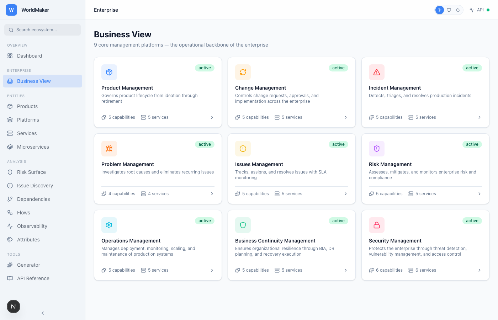
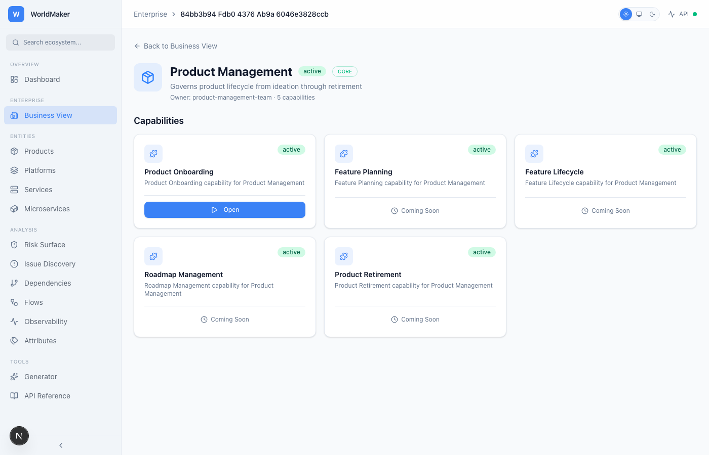

<h1 align="center">
  🌐 WorldMaker
</h1>

<p align="center">
  <strong>Enterprise Digital Lifecycle Management Platform</strong><br>
  Synthetic ecosystem generation · Enterprise onboarding workflows · Dependency graph intelligence · Risk surface analysis · OTel-native observability
</p>

<p align="center">
  
  
  
  
  
  
</p>

---

## What Is This?

WorldMaker generates, manages, and analyzes complete enterprise digital ecosystems — the kind with hundreds of services, thousands of dependencies, and the circular coupling patterns that keep platform architects up at night.

It's built for one thing: **making the invisible visible**. Products, platforms, services, capabilities, features, flows, traces, dependencies — every relationship that matters in an enterprise stack, modeled as first-class entities with full lifecycle management and real-time risk intelligence.

This isn't a monitoring tool. It's the system that models the systems.

## Why It Exists

Enterprise architectures are opaque. Dependencies are undocumented. Circular couplings hide in plain sight until a deployment cascades into a production incident. Risk lives in the gaps between what teams think they own and what actually happens at runtime.

WorldMaker closes that gap by generating realistic synthetic ecosystems that mirror real enterprise topologies — complete with the messy circular dependencies, deep transitive chains, and blast radius patterns that define actual operational risk. Then it gives you the intelligence layer to see it all.

---

## Enterprise Business View

WorldMaker ships with **9 core management platforms** that represent the operational backbone of any enterprise. These aren't just organizational taxonomy — they're active participants in the entity lifecycle, enforcing policy and enriching the intelligence graph.

### Core Management Platforms

| Platform | Purpose | Key Capability |
|----------|---------|----------------|
| **Product Management** | Product lifecycle ownership | Product Onboarding |
| **Change Management** | Controlled change delivery | Change Request |
| **Incident Management** | Detection and response | Incident Detection |
| **Problem Management** | Root cause analysis | Problem Analysis |
| **Issues Management** | Issue tracking and resolution | Issue Tracking |
| **Risk Management** | Risk identification and scoring | Risk Assessment |
| **Operations Management** | Operational health | Operational Monitoring |
| **Business Continuity Management** | Resilience planning | BCP Planning |
| **Security Management** | Security posture | Security Assessment |

### Two-Layer Architecture

WorldMaker separates entities into two layers:

- **Core Layer** — Bootstrapped at startup. The 9 management platforms, their 45 capabilities, and 45 services form the immutable operational backbone. Core entities survive ecosystem reset and provide the stable foundation that generated entities attach to.
- **Generated Layer** — Created by the ecosystem generator or through user onboarding workflows. Products, features, microservices, dependencies, and flows live here. Reset clears the generated layer while preserving the core.

This separation means you can generate, destroy, and regenerate ecosystems without losing the enterprise management structure that governs them.

### Onboarding Workflows

The Enterprise Business View transforms core platforms from read-only cards into interactive onboarding workflows. Click a platform, see its capabilities as actions, and execute:

- **Product Onboarding** — Register new products with ownership, status, versioning, and tagging. Products enter the generated layer and become visible across all analytics views.
- **Change Request** — Submit controlled changes linked to existing products. Changes carry type classification and priority, creating the audit trail that Incident Management reads when something breaks.
- **Incident Report** — Open incidents with severity classification linked to affected services. The causal chain back through changes and features is already encoded in the entity graph.
- **Issue Creation** — Track issues with priority and assignment against products. Issues feed into Problem Management's root cause analysis pipeline.

Additional capabilities display "Coming Soon" — the framework is extensible as platform workflows mature.

### The Intelligence Objective

The core platforms aren't filing cabinets. They're the scaffolding for an attribute enrichment pipeline where each function stamps metadata onto entities as they flow through the lifecycle. When AI reasoning (via LangGraph) sits on top of this graph, it doesn't guess at root cause — it walks a deterministic path through entities that already carry the evidence of what they've been through and what they're missing.

The architectural objective: **MTTD < 0** — the ability to detect the conditions for an incident before the incident ever occurs, because the system knows what attributes *should* exist and treats their absence as the signal.

---

## Screenshots

> All views support **Light** and **Dark** themes. Screenshots below auto-switch based on your GitHub theme setting.

### Dashboard
<picture>
  <source media="(prefers-color-scheme: dark)" srcset="docs/screenshots/dashboard-dark.png">
  <source media="(prefers-color-scheme: light)" srcset="docs/screenshots/dashboard-light.png">
  
</picture>

### Enterprise Business View
<picture>
  <source media="(prefers-color-scheme: dark)" srcset="docs/screenshots/enterprise-dark.png">
  <source media="(prefers-color-scheme: light)" srcset="docs/screenshots/enterprise-light.png">
  
</picture>

### Enterprise Platform Detail (Onboarding)
<picture>
  <source media="(prefers-color-scheme: dark)" srcset="docs/screenshots/enterprise-detail-dark.png">
  <source media="(prefers-color-scheme: light)" srcset="docs/screenshots/enterprise-detail-light.png">
  
</picture>

### Risk Surface
<picture>
  <source media="(prefers-color-scheme: dark)" srcset="docs/screenshots/risk-surface-dark.png">
  <source media="(prefers-color-scheme: light)" srcset="docs/screenshots/risk-surface-light.png">
  
</picture>

### Trace Explorer (OTel-Native Observability)
<picture>
  <source media="(prefers-color-scheme: dark)" srcset="docs/screenshots/trace-detail-dark.png">
  <source media="(prefers-color-scheme: light)" srcset="docs/screenshots/trace-detail-light.png">
  
</picture>

### Issue Discovery
<picture>
  <source media="(prefers-color-scheme: dark)" srcset="docs/screenshots/issues-dark.png">
  <source media="(prefers-color-scheme: light)" srcset="docs/screenshots/issues-light.png">
  
</picture>

### Dependencies & Blast Radius
<picture>
  <source media="(prefers-color-scheme: dark)" srcset="docs/screenshots/dependencies-dark.png">
  <source media="(prefers-color-scheme: light)" srcset="docs/screenshots/dependencies-light.png">
  
</picture>

### Services
<picture>
  <source media="(prefers-color-scheme: dark)" srcset="docs/screenshots/services-dark.png">
  <source media="(prefers-color-scheme: light)" srcset="docs/screenshots/services-light.png">
  
</picture>

### API Reference
<picture>
  <source media="(prefers-color-scheme: dark)" srcset="docs/screenshots/api-reference-dark.png">
  <source media="(prefers-color-scheme: light)" srcset="docs/screenshots/api-reference-light.png">
  
</picture>

---

## Features

### Enterprise Business View
Nine core management platforms bootstrapped at startup, forming the immutable operational backbone. Each platform exposes capabilities as interactive onboarding workflows — Product Onboarding, Change Requests, Incident Reports, and Issue Creation — with form validation, toast notifications, and real-time entity creation against the API. Two-layer architecture (core vs. generated) ensures the enterprise structure survives ecosystem reset.

### Ecosystem Generation
Generate deterministic synthetic ecosystems at three scales — small (~100 entities), medium (~1,000), or large (~20,000+). Each generation produces a complete digital lifecycle: products with features, platforms with capabilities, services with microservices, flows with steps, dependencies with circular detection, and full OTel-compatible traces.

### 17 Interactive Views

| View | What It Does |
|------|-------------|
| **Dashboard** | Entity counts, health scoring, distribution charts, critical issue alerts, enterprise quick link |
| **Enterprise Business View** | 9 core management platforms with capability counts and service counts |
| **Enterprise Platform Detail** | Capability action cards with onboarding forms (Product, Change, Incident, Issue) |
| **Products** | Product lifecycle management with feature ownership |
| **Platforms** | Platform registry with capability nesting |
| **Services** | Service catalog with dependency depth, blast radius, and microservice decomposition |
| **Microservices** | Deployment unit registry with language, framework, container image, and parent service links |
| **Risk Surface** | Dual-panel view — Product→Features (consumer risk) vs Platform→Capabilities (infrastructure risk) |
| **Issue Discovery** | Consolidated negative findings: circular deps, critical issues, warnings, degraded services |
| **Dependencies** | Dependency graph visualization with failure simulation |
| **Flows** | Flow definitions with step-by-step service chain execution |
| **Observability** | Trace listing with OTel-native span tree drill-down and waterfall visualization |
| **Generator** | Size selection, preview, generation, and ecosystem reset |
| **Search** | Full-text search across all entity types |
| **API Reference** | Complete endpoint documentation with 41 endpoints across 12 domains |

### Risk Intelligence
- **Circular dependency detection** — BFS-based cycle detection at dependency creation time
- **Blast radius analysis** — cascading impact calculation with severity and hop distance
- **Failure simulation** — simulate service outages with impact-by-severity breakdown and recovery recommendations
- **Health scoring** — automated ecosystem health assessment (0-100) with critical issue and warning generation

### OpenTelemetry-Native Traces
Execute flows to generate full OTel-compatible traces with span trees, timing data, status codes, attributes, events, and links. Traces render as interactive waterfall visualizations with span hierarchy, duration bars, and service-level timing.

### Dark / Light / System Theme
Full theme support with three modes — Light, Dark, and System (follows OS preference). Theme persists across sessions via localStorage.

---

## Architecture

```
┌─────────────────────────────────────────────────────────────┐
│                      Next.js 16 Frontend                     │
│  App Router · TanStack Query · Recharts · Tailwind CSS v4   │
│  17 routes · 12 components · 11 hooks · Dark/Light/System   │
├─────────────────────────────────────────────────────────────┤
│                      FastAPI Backend                         │
│  41 REST endpoints · Pydantic models · Lifespan events      │
├──────────┬──────────┬───────────┬──────────┬────────────────┤
│ Generator│  Store   │  Trace    │ Dep      │  Ecosystem     │
│ Engine   │ (Memory) │  Engine   │ Analysis │  Health        │
│          │          │  (OTel)   │ (BFS)    │  Scoring       │
├──────────┴──────────┴───────────┴──────────┴────────────────┤
│              Enterprise Core Bootstrap Layer                  │
│  9 Platforms · 45 Capabilities · 45 Services · Two-Layer    │
├─────────────────────────────────────────────────────────────┤
│                   Infrastructure (Optional)                   │
│  PostgreSQL · MongoDB · Neo4j · Redis · Kafka · Zookeeper    │
└─────────────────────────────────────────────────────────────┘
```

### Entity Hierarchy

```
Product Domain (Consumer Risk)          Platform Domain (Infrastructure Risk)
─────────────────────────────          ──────────────────────────────────────
Product                                 Platform  [CORE]
  └── Feature                             └── Capability  [CORE]
        └── User Flows                          └── Service  [CORE]
                                                      └── Microservice

              ┌───────────────────────┐
              │  Enterprise Workflows │ ← Onboarding forms create entities
              │  (Change · Incident   │ ← Each workflow stamps metadata
              │   Issue · Product)    │ ← Feeds the intelligence graph
              └───────────────────────┘

                        ┌──────────┐
                        │   Flow   │ ← Connects services through steps
                        │   Steps  │ ← Generates OTel traces on execute
                        └──────────┘

                     ┌──────────────┐
                     │ Dependency   │ ← Links services directionally
                     │ (w/ circular │ ← Auto-detects cycles via BFS
                     │  detection)  │
                     └──────────────┘

Layers:
  ● CORE      — Bootstrapped at startup, survives reset
  ○ GENERATED — Created by generator or onboarding, cleared on reset
```

---

## Quick Start

### Prerequisites
- Python 3.10+
- Node.js 18+
- [uv](https://docs.astral.sh/uv/) (Python package manager)

### One Command

```bash
./start.sh
```

This starts infrastructure → worker → API → frontend, waits for health checks, and opens your browser to the dashboard. All processes run in background with logs written to `logs/`.

**Flags:**
- `--no-infra` — skip Docker infrastructure
- `--no-frontend` — skip Next.js frontend
- `--api-only` — API server only
- `--no-browser` — don't auto-open browser

### Manual Start

```bash
# Backend
cd worldmaker
uv sync
uv run worldmaker serve --reload

# Frontend (separate terminal)
cd worldmaker/frontend
npm install
npm run dev
```

API at **http://localhost:8000** (docs at **/api/docs**). Frontend at **http://localhost:3000**.

### Generate an Ecosystem

```bash
# Via CLI
uv run worldmaker generate --size large

# Via API
curl -X POST "http://localhost:8000/api/v1/generate?size=large&execute_flows=true"

# Via UI — navigate to Generator → Select Large → Generate Ecosystem
```

### Stop / Restart

```bash
./shutdown.sh     # Graceful stop with port cleanup and logging
./restart.sh      # Full restart cycle (passes flags through)
```

### (Optional) Full Infrastructure

```bash
docker compose up -d postgres mongodb neo4j redis kafka zookeeper
./start.sh
```

The platform works fully with the in-memory store — Docker infrastructure is optional and enables persistent storage.

---

## API Overview

All endpoints are prefixed with `/api/v1`. Full interactive docs at `/api/docs` (Swagger) and `/api/redoc` (ReDoc).

| Domain | Endpoints | Key Operations |
|--------|-----------|---------------|
| Ecosystem | 5 | Overview, health scoring, search, audit trail |
| Products | 5 | Full CRUD with status filtering |
| Features | 5 | Full CRUD with product relationship |
| Platforms | 5 | Full CRUD with layer filtering (core/generated) |
| Capabilities | 2 | List and create with platform filter |
| Services | 6 | Full CRUD + agentic context endpoint |
| Microservices | 3 | List, create, get with service filter |
| Flows | 9 | Full CRUD + step mgmt + execution + traces |
| Traces | 2 | List traces, get span tree (OTel/Jaeger format) |
| Dependencies | 4 | Graph queries, circular detection, failure simulation |
| Generator | 3 | Generate, preview, reset (preserves core layer) |
| Health | 2 | API health, store status |

**For AI agents:** Start with `GET /ecosystem/overview`, use `GET /services/{id}/context` for complete service intelligence, and query `GET /dependencies/circular` + `POST /simulate/failure/{id}` for risk assessment.

---

## Project Structure

```
worldmaker/
├── src/worldmaker/
│   ├── api/            # FastAPI routes (10 files, 41 endpoints)
│   ├── cli/            # CLI commands
│   ├── db/             # Store implementations (in-memory, layer-aware)
│   ├── engine/         # Trace engine, scheduler, flow executor
│   ├── events/         # Event system
│   ├── generators/     # Ecosystem generator + core platform bootstrap
│   └── models/         # Pydantic domain models (with LayerType enum)
├── tests/              # 20 test files, 144+ test cases
├── frontend/
│   ├── src/app/        # 17 Next.js routes (incl. enterprise/[platformId])
│   ├── src/components/ # UI components + 4 onboarding forms
│   ├── src/hooks/      # TanStack Query hooks (11 domain hooks)
│   └── src/lib/        # API client, types, utilities
├── scripts/            # Screenshot automation (Playwright)
├── logs/               # Runtime logs (api, frontend, worker, infra, shutdown)
├── docker-compose.yml  # Full infra stack
├── start.sh            # One-command startup with health checks + browser open
├── shutdown.sh         # Graceful shutdown with port cleanup and logging
├── restart.sh          # Full restart cycle
├── Makefile            # Dev commands
└── pyproject.toml      # Python project config
```

---

## Development

```bash
make dev          # Install all dependencies
make test         # Run test suite (144+ tests)
make serve        # Start API server with hot reload
make generate     # Generate sample ecosystem
make lint         # Run ruff linter
make type-check   # Run mypy type checking
make docker-up    # Start full infrastructure

# Full stack
./start.sh        # Start everything + open browser
./shutdown.sh     # Stop everything
./restart.sh      # Restart everything
```

---

## Tech Stack

| Layer | Technology |
|-------|-----------|
| **Backend** | Python 3.10+, FastAPI, Pydantic v2, uvicorn |
| **Frontend** | Next.js 16, React 19, TypeScript, Tailwind CSS v4 |
| **State** | TanStack Query v5 (React Query) |
| **Charts** | Recharts |
| **Theming** | next-themes (Dark/Light/System) |
| **Traces** | OpenTelemetry-compatible format |
| **Storage** | In-memory (default), PostgreSQL, MongoDB, Neo4j |
| **Messaging** | Redis, Kafka (optional) |
| **Package Mgmt** | uv (Python), npm (Node) |
| **Screenshots** | Playwright (headless Chromium) |

---

## License

MIT

---

<p align="center">
  <em>Built by <a href="https://github.com/jsbarth">@jsbarth</a> — making the invisible visible.</em>
</p>
