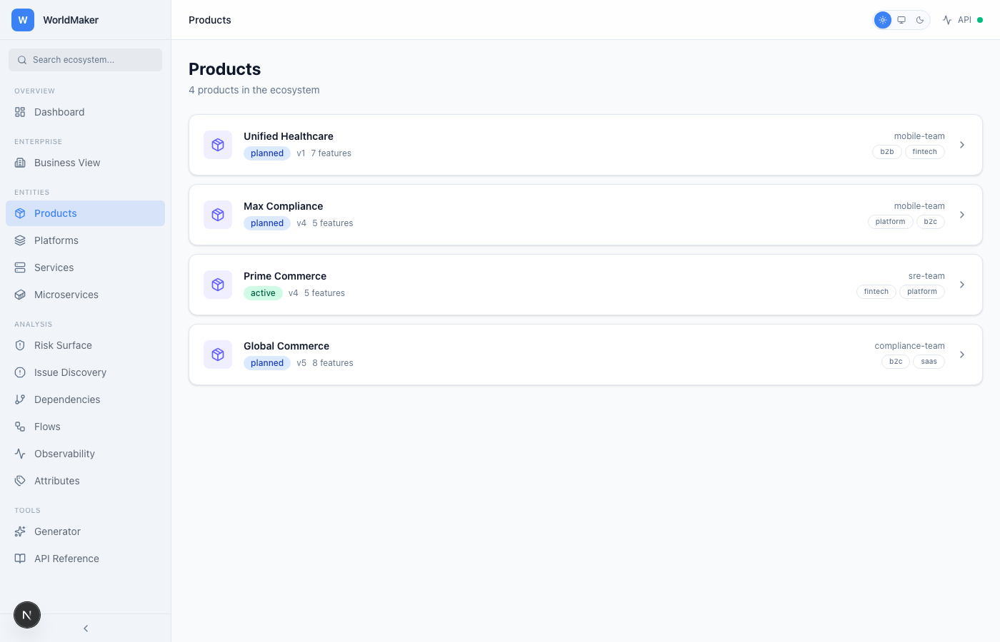
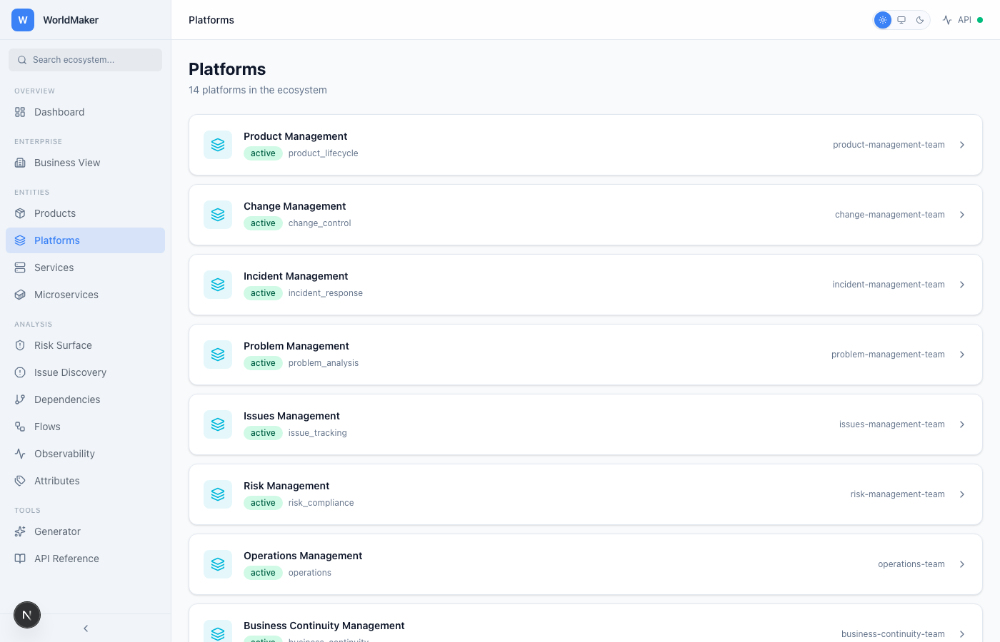
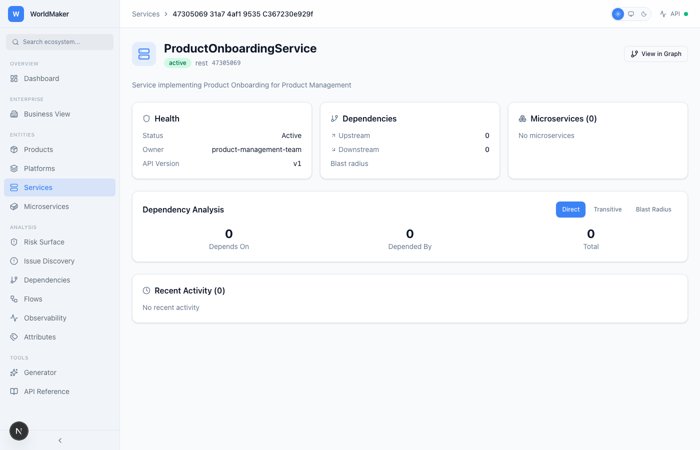
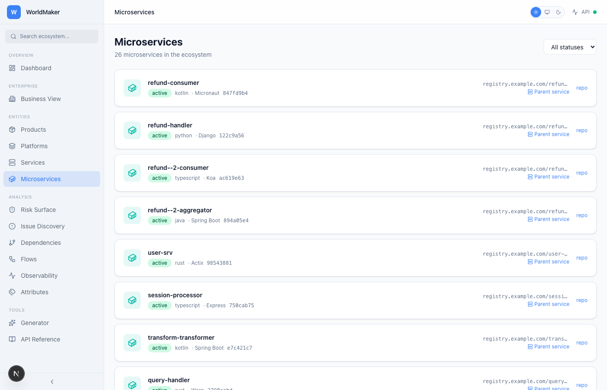
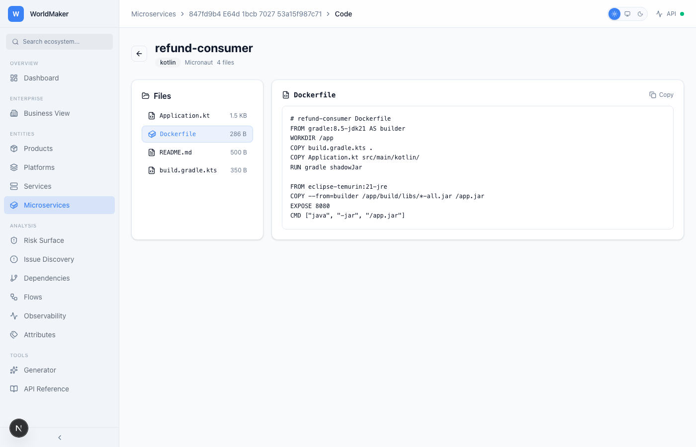
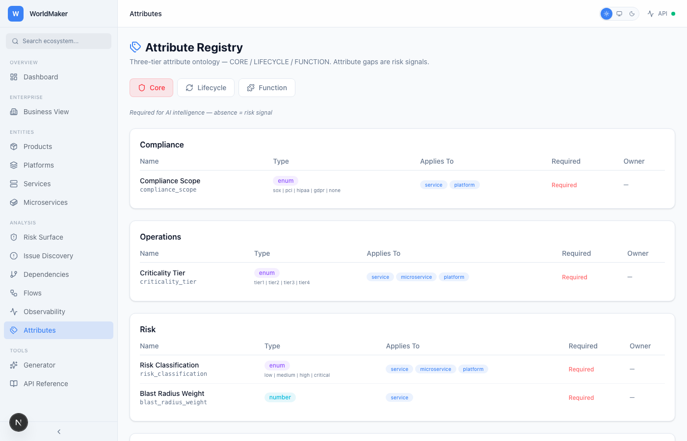
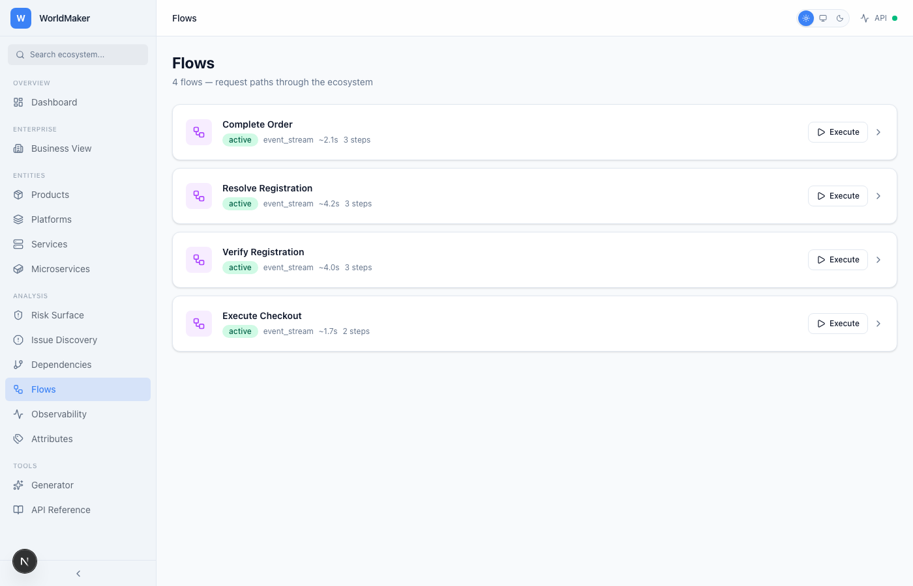
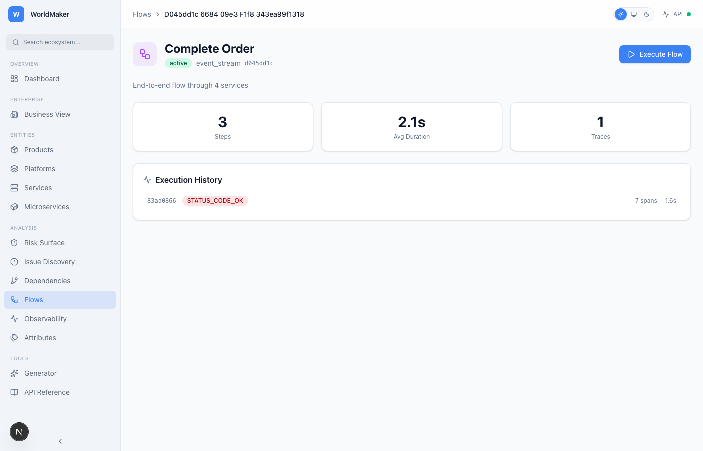
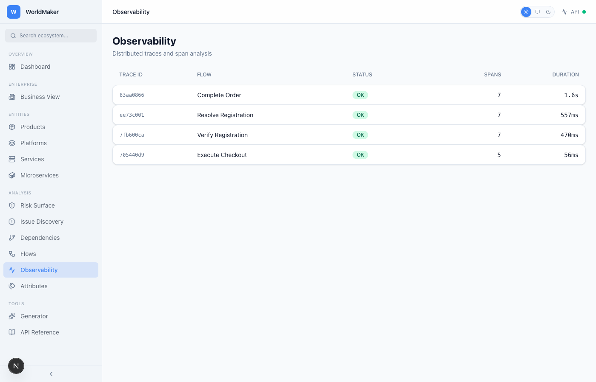
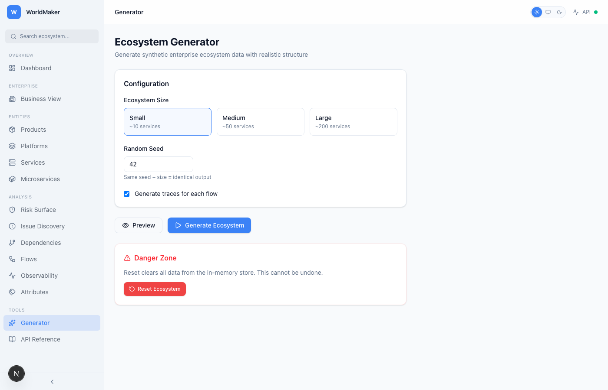

<h1 align="center">
  WorldMaker
</h1>

<p align="center">
  <strong>Enterprise Digital Lifecycle Intelligence Platform</strong><br>
  Source code lifecycle lineage · Active risk intelligence · Attribute-driven gap analysis · OTel-native observability · Inside-out threat discovery
</p>

<p align="center">
  
  
  
  
  
  
</p>

---

## What Is This?

WorldMaker generates, manages, and analyzes complete enterprise digital ecosystems — the kind with hundreds of services, thousands of dependencies, and the circular coupling patterns that keep platform architects up at night.

It's built for one thing: **making the invisible visible**. Products, platforms, services, capabilities, features, flows, traces, dependencies, source code, attributes — every relationship that matters in an enterprise stack, modeled as first-class entities with full lifecycle management and real-time risk intelligence.

This isn't a monitoring tool. It's the system that models the systems.

## Why It Exists

Enterprise architectures are opaque. Dependencies are undocumented. Circular couplings hide in plain sight until a deployment cascades into a production incident. Risk lives in the gaps between what teams think they own and what actually happens at runtime.

WorldMaker closes that gap by generating realistic synthetic ecosystems that mirror real enterprise topologies — complete with the messy circular dependencies, deep transitive chains, and blast radius patterns that define actual operational risk. Then it gives you the intelligence layer to see it all.

---

## The Vision: Active Intelligence for Risk Outcomes

> **[Read the full Lifecycle Intelligence brief →](LIFECYCLE-INTELLIGENCE.md)**

WorldMaker isn't building toward compliance dashboards. Compliance is checklist-based — it doesn't need AI. What needs AI is **risk outcomes**: the ability to reason across an entire enterprise topology in real time, detect the conditions that precede incidents before they occur, and respond to changes the moment they propagate through the dependency graph.

This platform builds the intelligence substrate for **MTTD < 0** — Mean Time to Detect below zero — where the system identifies risk conditions *before* the incident ever materializes. Every entity carries the evidence of what it's been through and what it's missing. When AI reasoning sits on top of this graph, it doesn't guess at root cause. It walks a deterministic path.

**Source code → Microservice → Service → Platform → Dependency Graph → Attribute Gaps → Risk Signal.**

That's the lineage. Any break in this chain — a missing attribute, a circular dependency, a service without a threat model — is a condition detectable before the incident. The attribute system doesn't just track metadata. It defines what *should* exist, and treats absence as the signal.

---

## Screenshots

> All views support **Light** and **Dark** themes. Screenshots below auto-switch based on your GitHub theme setting.

### Dashboard
<picture>
  <source media="(prefers-color-scheme: dark)" srcset="docs/screenshots/dashboard-dark.png">
  <source media="(prefers-color-scheme: light)" srcset="docs/screenshots/dashboard-light.png">
  
</picture>

### Enterprise Business View
<picture>
  <source media="(prefers-color-scheme: dark)" srcset="docs/screenshots/enterprise-dark.png">
  <source media="(prefers-color-scheme: light)" srcset="docs/screenshots/enterprise-light.png">
  
</picture>

### Enterprise Platform Detail (Onboarding)
<picture>
  <source media="(prefers-color-scheme: dark)" srcset="docs/screenshots/enterprise-detail-dark.png">
  <source media="(prefers-color-scheme: light)" srcset="docs/screenshots/enterprise-detail-light.png">
  
</picture>

### Products
<picture>
  <source media="(prefers-color-scheme: dark)" srcset="docs/screenshots/products-dark.png">
  <source media="(prefers-color-scheme: light)" srcset="docs/screenshots/products-light.png">
  
</picture>

### Platforms
<picture>
  <source media="(prefers-color-scheme: dark)" srcset="docs/screenshots/platforms-dark.png">
  <source media="(prefers-color-scheme: light)" srcset="docs/screenshots/platforms-light.png">
  
</picture>

### Services
<picture>
  <source media="(prefers-color-scheme: dark)" srcset="docs/screenshots/services-dark.png">
  <source media="(prefers-color-scheme: light)" srcset="docs/screenshots/services-light.png">
  
</picture>

### Service Detail
<picture>
  <source media="(prefers-color-scheme: dark)" srcset="docs/screenshots/service-detail-dark.png">
  <source media="(prefers-color-scheme: light)" srcset="docs/screenshots/service-detail-light.png">
  
</picture>

### Microservices
<picture>
  <source media="(prefers-color-scheme: dark)" srcset="docs/screenshots/microservices-dark.png">
  <source media="(prefers-color-scheme: light)" srcset="docs/screenshots/microservices-light.png">
  
</picture>

### Code Viewer
<picture>
  <source media="(prefers-color-scheme: dark)" srcset="docs/screenshots/code-viewer-dark.png">
  <source media="(prefers-color-scheme: light)" srcset="docs/screenshots/code-viewer-light.png">
  
</picture>

### Risk Surface
<picture>
  <source media="(prefers-color-scheme: dark)" srcset="docs/screenshots/risk-surface-dark.png">
  <source media="(prefers-color-scheme: light)" srcset="docs/screenshots/risk-surface-light.png">
  
</picture>

### Trace Explorer (OTel-Native Observability)
<picture>
  <source media="(prefers-color-scheme: dark)" srcset="docs/screenshots/trace-detail-dark.png">
  <source media="(prefers-color-scheme: light)" srcset="docs/screenshots/trace-detail-light.png">
  
</picture>

### Issue Discovery
<picture>
  <source media="(prefers-color-scheme: dark)" srcset="docs/screenshots/issues-dark.png">
  <source media="(prefers-color-scheme: light)" srcset="docs/screenshots/issues-light.png">
  
</picture>

### Dependencies & Blast Radius
<picture>
  <source media="(prefers-color-scheme: dark)" srcset="docs/screenshots/dependencies-dark.png">
  <source media="(prefers-color-scheme: light)" srcset="docs/screenshots/dependencies-light.png">
  
</picture>

### Attribute Registry & Gap Analysis
<picture>
  <source media="(prefers-color-scheme: dark)" srcset="docs/screenshots/attributes-dark.png">
  <source media="(prefers-color-scheme: light)" srcset="docs/screenshots/attributes-light.png">
  
</picture>

### Flows
<picture>
  <source media="(prefers-color-scheme: dark)" srcset="docs/screenshots/flows-dark.png">
  <source media="(prefers-color-scheme: light)" srcset="docs/screenshots/flows-light.png">
  
</picture>

### Flow Detail
<picture>
  <source media="(prefers-color-scheme: dark)" srcset="docs/screenshots/flow-detail-dark.png">
  <source media="(prefers-color-scheme: light)" srcset="docs/screenshots/flow-detail-light.png">
  
</picture>

### Observability
<picture>
  <source media="(prefers-color-scheme: dark)" srcset="docs/screenshots/observability-dark.png">
  <source media="(prefers-color-scheme: light)" srcset="docs/screenshots/observability-light.png">
  
</picture>

### Generator
<picture>
  <source media="(prefers-color-scheme: dark)" srcset="docs/screenshots/generator-dark.png">
  <source media="(prefers-color-scheme: light)" srcset="docs/screenshots/generator-light.png">
  
</picture>

### API Reference
<picture>
  <source media="(prefers-color-scheme: dark)" srcset="docs/screenshots/api-reference-dark.png">
  <source media="(prefers-color-scheme: light)" srcset="docs/screenshots/api-reference-light.png">
  
</picture>

---

## Enterprise Business View

WorldMaker ships with **9 core management platforms** that represent the operational backbone of any enterprise. These aren't just organizational taxonomy — they're active participants in the entity lifecycle, enforcing policy and enriching the intelligence graph.

### Core Management Platforms

| Platform | Purpose | Key Capability |
|----------|---------|----------------|
| **Product Management** | Product lifecycle ownership | Product Onboarding |
| **Change Management** | Controlled change delivery | Change Request |
| **Incident Management** | Detection and response | Incident Detection |
| **Problem Management** | Root cause analysis | Problem Analysis |
| **Issues Management** | Issue tracking and resolution | Issue Tracking |
| **Risk Management** | Risk identification and scoring | Risk Assessment |
| **Operations Management** | Operational health | Operational Monitoring |
| **Business Continuity Management** | Resilience planning | BCP Planning |
| **Security Management** | Security posture | Security Assessment |

### Two-Layer Architecture

WorldMaker separates entities into two layers:

- **Core Layer** — Bootstrapped at startup. The 9 management platforms, their 45 capabilities, 45 services, and 20 attribute definitions form the immutable operational backbone. Core entities survive ecosystem reset and provide the stable foundation that generated entities attach to.
- **Generated Layer** — Created by the ecosystem generator or through user onboarding workflows. Products, features, microservices, dependencies, and flows live here. Reset clears the generated layer while preserving the core.

This separation means you can generate, destroy, and regenerate ecosystems without losing the enterprise management structure that governs them.

### Onboarding Workflows

The Enterprise Business View transforms core platforms from read-only cards into interactive onboarding workflows. Click a platform, see its capabilities as actions, and execute:

- **Product Onboarding** — Register new products with ownership, status, versioning, and tagging.
- **Change Request** — Submit controlled changes linked to existing products with type classification and priority.
- **Incident Report** — Open incidents with severity classification linked to affected services.
- **Issue Creation** — Track issues with priority and assignment against products.

---

## Features

### Microservice Code Generation

Every microservice gets a real code repository scaffolded across **6 languages and 24 frameworks**:

| Language | Frameworks | Handler | Dependencies |
|----------|-----------|---------|-------------|
| Python | FastAPI, Django, Flask, Celery | `handler.py` | `requirements.txt` |
| Go | Gin, Echo, Fiber, gRPC | `main.go` | `go.mod` |
| Java | Spring Boot, Micronaut, Quarkus, Vert.x | `Handler.java` | `pom.xml` |
| TypeScript | NestJS, Express, Fastify, Koa | `handler.ts` | `package.json` |
| Rust | Actix, Axum, Rocket, Warp | `main.rs` | `Cargo.toml` |
| Kotlin | Ktor, Spring Boot, Micronaut | `Application.kt` | `build.gradle.kts` |

Each repository includes a handler with health check and event endpoints, a multi-stage Dockerfile, framework-specific dependency manifest, and a README with endpoint documentation. The in-app **Code Viewer** provides a two-panel browser — file list on the left, syntax-highlighted content on the right with copy-to-clipboard.

This scaffolded code is the foundation for **inside-out risk discovery**: static analysis that detects vulnerabilities, missing security controls, and dependency risks in the source code *before* runtime.

### Attribute Registry & Gap Analysis

A three-tier attribute system defines what metadata *should* exist on every entity — and treats its absence as a risk signal:

- **CORE** (5 required attributes) — `risk_classification`, `data_sensitivity`, `compliance_scope`, `criticality_tier`, `blast_radius_weight`. Missing any of these on a service or microservice is an immediate risk flag.
- **LIFECYCLE** (12 attributes) — Stamped by core management platforms as entities move through workflows: `threat_model_status`, `incident_count_30d`, `mttr_hours`, `dr_plan_status`, `sla_compliance_pct`, etc.
- **FUNCTION** (extensible) — Platform owners add domain-specific attributes at runtime.

The **gap analysis** endpoint walks every entity, checks for missing required attributes, and produces a risk score. This is the pre-incident detection mechanism — the data layer powering MTTD < 0.

### Ecosystem Generation

Generate deterministic synthetic ecosystems at three scales — small (~100 entities), medium (~1,000), or large (~20,000+). Each generation produces a complete digital lifecycle: products with features, platforms with capabilities, services with microservices, flows with steps, dependencies with circular detection, full OTel-compatible traces, and scaffolded code repositories.

### 22 Interactive Views

| View | What It Does |
|------|-------------|
| **Dashboard** | Entity counts, health scoring, distribution charts, critical issue alerts, enterprise quick links |
| **Enterprise Business View** | 9 core management platforms with capability counts and service counts |
| **Enterprise Platform Detail** | Capability action cards with onboarding forms (Product, Change, Incident, Issue) |
| **Products** | Product lifecycle management with feature ownership and status filtering |
| **Product Detail** | Product detail with feature list and metadata |
| **Platforms** | Platform registry with capability nesting and layer filtering (core/generated) |
| **Platform Detail** | Platform detail with capabilities and implementing services |
| **Services** | Service catalog with dependency depth, blast radius, and microservice decomposition |
| **Service Detail** | Full service intelligence — dependencies, blast radius, microservices, health context |
| **Microservices** | Deployment unit registry with language, framework, container image, and code repo links |
| **Code Viewer** | Two-panel source code browser with file list, language badge, and copy-to-clipboard |
| **Risk Surface** | Dual-panel view — Product→Features (consumer risk) vs Platform→Capabilities (infrastructure risk) |
| **Issue Discovery** | Consolidated negative findings: circular deps, critical issues, warnings, degraded services |
| **Dependencies** | Dependency graph visualization with failure simulation |
| **Flows** | Flow definitions with step-by-step service chain execution |
| **Flow Detail** | Flow steps, execution, and trace generation |
| **Observability** | Trace listing with OTel-native span tree drill-down |
| **Trace Detail** | Span waterfall visualization with service timing, attributes, and events |
| **Attributes** | Three-tier attribute registry with gap analysis panel |
| **Generator** | Size selection, preview, generation, and ecosystem reset |
| **Search** | Full-text search across all entity types |
| **API Reference** | Complete endpoint documentation with 41 endpoints across 12 domains |

### Risk Intelligence

- **Circular dependency detection** — BFS-based cycle detection at dependency creation time
- **Blast radius analysis** — cascading impact calculation with severity and hop distance
- **Failure simulation** — simulate service outages with impact-by-severity breakdown and recovery recommendations
- **Health scoring** — automated ecosystem health assessment (0-100) with critical issue and warning generation
- **Attribute gap analysis** — entities missing required attributes surfaced as risk signals with severity scoring

### OpenTelemetry-Native Traces

Execute flows to generate full OTel-compatible traces with span trees, timing data, status codes, attributes, events, and links. Traces render as interactive waterfall visualizations with span hierarchy, duration bars, and service-level timing. Export in OTel or Jaeger format.

### Dark / Light / System Theme

Full theme support with three modes — Light, Dark, and System (follows OS preference). Theme persists across sessions and applies consistently across all views including the sidebar navigation.

---

## Architecture

```
┌─────────────────────────────────────────────────────────────┐
│                      Next.js 16 Frontend                     │
│  App Router · TanStack Query · Recharts · Tailwind CSS v4   │
│  22 routes · 17 components · 14 hooks · Dark/Light/System   │
├─────────────────────────────────────────────────────────────┤
│                      FastAPI Backend                         │
│  41 REST endpoints · Pydantic models · Lifespan events      │
├──────────┬──────────┬───────────┬──────────┬────────────────┤
│ Generator│  Store   │  Trace    │ Dep      │  Attribute     │
│ Engine   │ (Memory) │  Engine   │ Analysis │  Registry      │
│          │          │  (OTel)   │ (BFS)    │  + Gap Analysis│
├──────────┼──────────┴───────────┼──────────┴────────────────┤
│ Codegen  │  Enterprise Core Bootstrap Layer                  │
│ (6 langs)│  9 Platforms · 45 Capabilities · 45 Services     │
│          │  20 Attribute Definitions · Two-Layer             │
├──────────┴──────────────────────────────────────────────────┤
│                   Infrastructure (Optional)                   │
│  PostgreSQL · MongoDB · Neo4j · Redis · Kafka · Zookeeper    │
└─────────────────────────────────────────────────────────────┘
```

### Entity Hierarchy

```
Product Domain (Consumer Risk)          Platform Domain (Infrastructure Risk)
─────────────────────────────          ──────────────────────────────────────
Product                                 Platform  [CORE]
  └── Feature                             └── Capability  [CORE]
        └── User Flows                          └── Service  [CORE]
                                                      └── Microservice
                                                            └── Code Repository
                                                                  (handler · Dockerfile · deps)

              ┌───────────────────────┐
              │  Enterprise Workflows │ ← Onboarding forms create entities
              │  (Change · Incident   │ ← Each workflow stamps metadata
              │   Issue · Product)    │ ← Feeds the intelligence graph
              └───────────────────────┘

                     ┌──────────────┐
                     │ Attribute    │ ← CORE / LIFECYCLE / FUNCTION tiers
                     │ Registry     │ ← Gap = missing required attribute
                     │ + Gap        │ ← Absence IS the risk signal
                     │   Analysis   │
                     └──────────────┘

                        ┌──────────┐
                        │   Flow   │ ← Connects services through steps
                        │   Steps  │ ← Generates OTel traces on execute
                        └──────────┘

                     ┌──────────────┐
                     │ Dependency   │ ← Links services directionally
                     │ (w/ circular │ ← Auto-detects cycles via BFS
                     │  detection)  │ ← Blast radius + failure simulation
                     └──────────────┘

Layers:
  ● CORE      — Bootstrapped at startup, survives reset
  ○ GENERATED — Created by generator or onboarding, cleared on reset
```

---

## Quick Start

### Prerequisites
- Python 3.10+
- Node.js 18+
- [uv](https://docs.astral.sh/uv/) (Python package manager)

### One Command

```bash
./start.sh
```

This starts infrastructure → worker → API → frontend, waits for health checks, and opens your browser to the dashboard. All processes run in background with logs written to `logs/`.

**Flags:**
- `--no-infra` — skip Docker infrastructure
- `--no-frontend` — skip Next.js frontend
- `--api-only` — API server only
- `--no-browser` — don't auto-open browser

### Manual Start

```bash
# Backend
cd worldmaker
uv sync
uv run worldmaker serve --reload

# Frontend (separate terminal)
cd worldmaker/frontend
npm install
npm run dev
```

API at **http://localhost:8000** (docs at **/api/docs**). Frontend at **http://localhost:3000**.

### Generate an Ecosystem

```bash
# Via CLI
uv run worldmaker generate --size large

# Via API
curl -X POST "http://localhost:8000/api/v1/generate?size=large&execute_flows=true"

# Via UI — navigate to Generator → Select Large → Generate Ecosystem
```

### Stop / Restart

```bash
./shutdown.sh     # Graceful stop with port cleanup and logging
./restart.sh      # Full restart cycle (passes flags through)
```

### (Optional) Full Infrastructure

```bash
docker compose up -d postgres mongodb neo4j redis kafka zookeeper
./start.sh
```

The platform works fully with the in-memory store — Docker infrastructure is optional and enables persistent storage.

---

## API Overview

All endpoints are prefixed with `/api/v1`. Full interactive docs at `/api/docs` (Swagger) and `/api/redoc` (ReDoc).

| Domain | Endpoints | Key Operations |
|--------|-----------|---------------|
| Ecosystem | 5 | Overview, health scoring, search, audit trail |
| Products | 5 | Full CRUD with status filtering |
| Features | 5 | Full CRUD with product relationship |
| Platforms | 5 | Full CRUD with layer filtering (core/generated) |
| Capabilities | 2 | List and create with platform filter |
| Services | 6 | Full CRUD + agentic context endpoint |
| Microservices | 3 | List, create, get with service filter |
| Flows | 9 | Full CRUD + step mgmt + execution + traces |
| Traces | 2 | List traces, get span tree (OTel/Jaeger format) |
| Dependencies | 4 | Graph queries, circular detection, failure simulation |
| Generator | 3 | Generate, preview, reset (preserves core layer) |
| Codegen | 4 | Code manifest, file content, scaffold, delete repo |
| Attributes | 8 | Definitions, gap analysis, attribute stamping, entity attributes |
| Health | 2 | API health, store status |

**For AI agents:** Start with `GET /ecosystem/overview`, use `GET /services/{id}/context` for complete service intelligence, and query `GET /attributes/gaps` + `POST /simulate/failure/{id}` for risk assessment.

---

## Project Structure

```
worldmaker/
├── src/worldmaker/
│   ├── api/            # FastAPI routes (12 files, 41+ endpoints)
│   ├── cli/            # CLI commands (serve, generate, info)
│   ├── codegen/        # Code generation (6 langs × 4 frameworks)
│   ├── db/             # Store implementations (in-memory, layer-aware)
│   ├── engine/         # Trace engine, scheduler, flow executor
│   ├── events/         # Event system
│   ├── generators/     # Ecosystem generator + core platform/attribute bootstrap
│   └── models/         # Pydantic domain models (with LayerType enum)
├── tests/              # 9 test files, 195 test cases
├── frontend/
│   ├── src/app/        # 22 Next.js routes
│   ├── src/components/ # 17 UI components + 4 onboarding forms
│   ├── src/hooks/      # 14 TanStack Query hooks
│   └── src/lib/        # API client, types, utilities
├── scripts/            # Screenshot automation (Playwright)
├── docs/screenshots/   # Light + dark screenshots for all views
├── repos/              # Generated microservice code repositories
├── logs/               # Runtime logs (api, frontend, worker, infra)
├── docker-compose.yml  # Full infra stack (8 services)
├── start.sh            # One-command startup with health checks
├── shutdown.sh         # Graceful shutdown with port cleanup
├── restart.sh          # Full restart cycle
├── Makefile            # Dev commands (30+ targets)
└── pyproject.toml      # Python project config
```

---

## Development

```bash
make dev          # Install all dependencies
make test         # Run test suite (195 tests)
make serve        # Start API server with hot reload
make generate     # Generate sample ecosystem
make lint         # Run ruff linter
make type-check   # Run mypy type checking
make docker-up    # Start full infrastructure

# Full stack
./start.sh        # Start everything + open browser
./shutdown.sh     # Stop everything
./restart.sh      # Restart everything

# Screenshots (requires running servers + Playwright)
npx playwright install chromium
node scripts/take-screenshots.mjs
```

---

## Tech Stack

| Layer | Technology |
|-------|-----------|
| **Backend** | Python 3.10+, FastAPI, Pydantic v2, uvicorn |
| **Frontend** | Next.js 16, React 19, TypeScript, Tailwind CSS v4 |
| **State** | TanStack Query v5 (React Query) |
| **Charts** | Recharts |
| **Theming** | next-themes (Dark/Light/System) |
| **Traces** | OpenTelemetry-compatible format |
| **Code Generation** | 6 languages, 24 frameworks, multi-stage Docker |
| **Attributes** | Three-tier registry (CORE/LIFECYCLE/FUNCTION) |
| **Storage** | In-memory (default), PostgreSQL, MongoDB, Neo4j |
| **Messaging** | Redis, Kafka (optional) |
| **Package Mgmt** | uv (Python), npm (Node) |
| **Screenshots** | Playwright (headless Chromium) |

---

## What's Next

WorldMaker is the intelligence substrate. The next layers build on this graph:

- **LangGraph Agents** — Autonomous risk reasoning that traverses the entity graph, reads attribute gaps, correlates blast radius with criticality, and flags risk conditions in real time
- **Static Code Analysis** — Vulnerability detection on scaffolded microservice code before deployment
- **Real-Time Attribute Enrichment** — Event-driven stamping via Kafka as entities flow through lifecycle workflows
- **Risk Scoring Models** — Trained on the topology graph to predict cascade failure probability
- **AWS Deployment** — ECS/EKS, RDS, S3-backed code repos for enterprise scale

> **[Read the full vision: LIFECYCLE-INTELLIGENCE.md →](LIFECYCLE-INTELLIGENCE.md)**

---

## License

MIT

---

<p align="center">
  <em>Built by <a href="https://github.com/jsbarth">@jsbarth</a> — making the invisible visible.</em>
</p>
