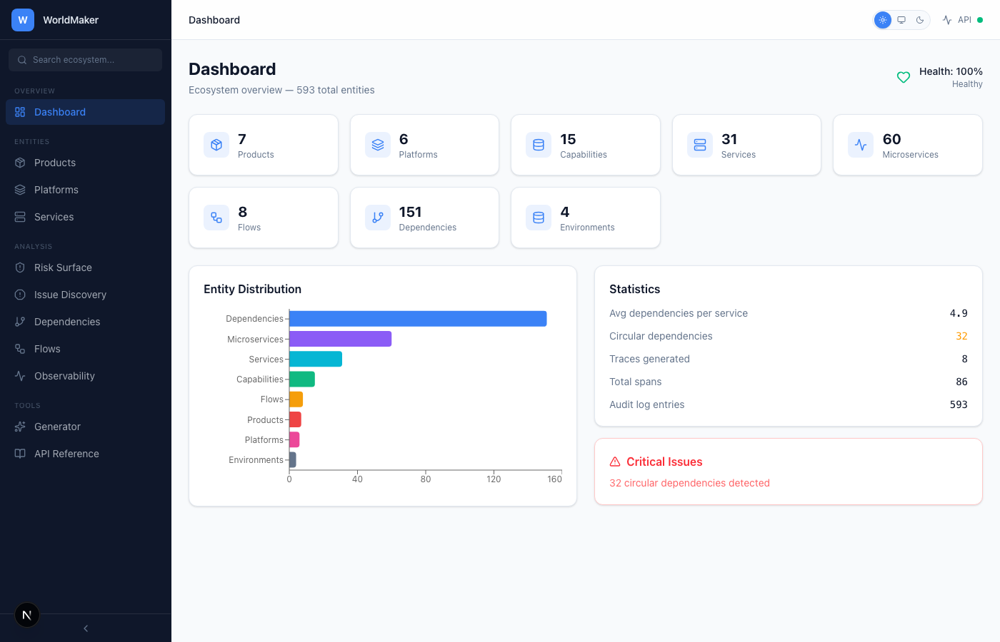
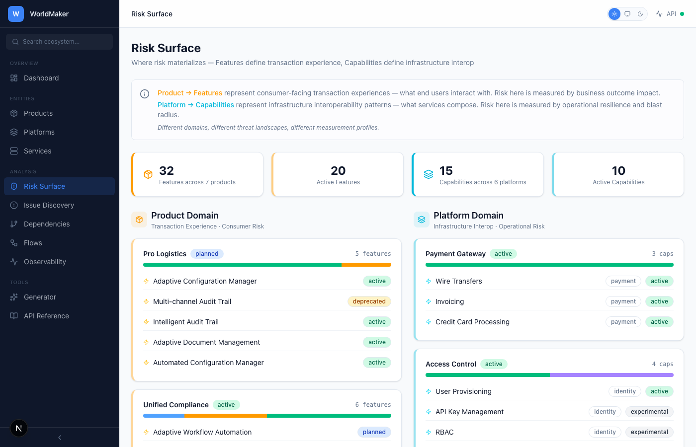
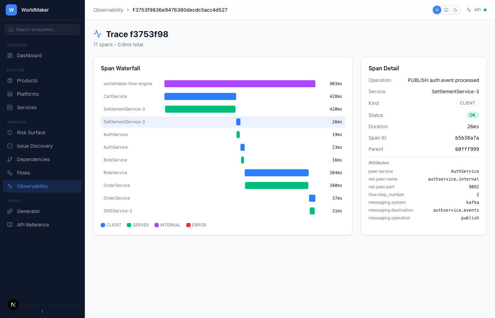
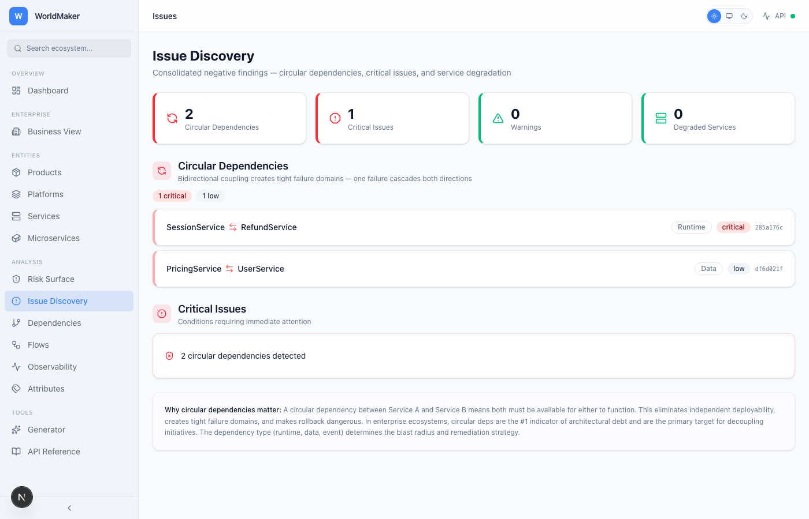
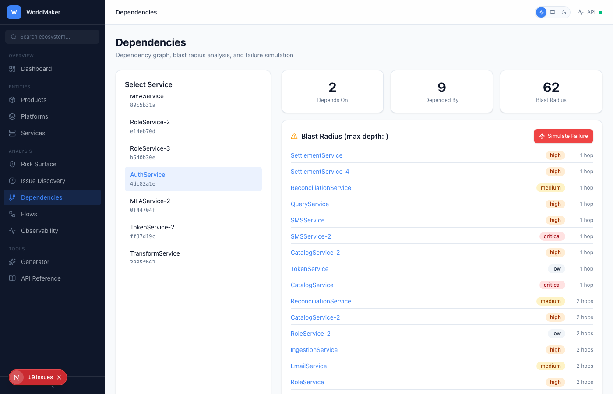
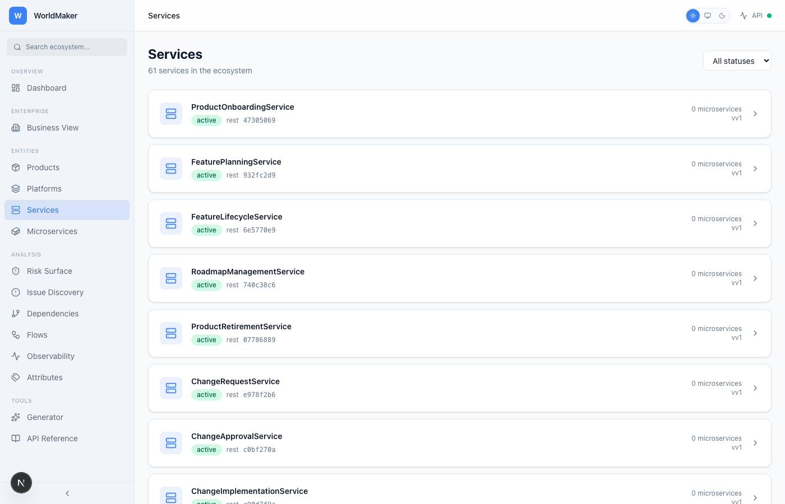
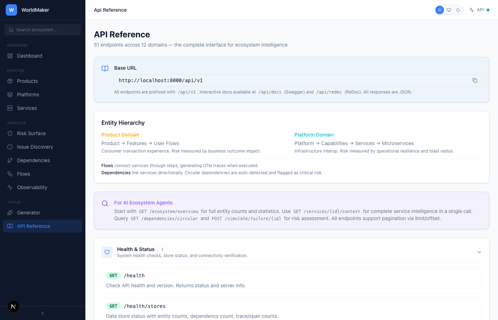

<h1 align="center">
  🌐 WorldMaker
</h1>

<p align="center">
  <strong>Enterprise Digital Lifecycle Management Platform</strong><br>
  Synthetic ecosystem generation · Dependency graph intelligence · Risk surface analysis · OTel-native observability
</p>

<p align="center">
  
  
  
  
  
  
</p>

---

## What Is This?

WorldMaker generates, manages, and analyzes complete enterprise digital ecosystems — the kind with hundreds of services, thousands of dependencies, and the circular coupling patterns that keep platform architects up at night.

It's built for one thing: **making the invisible visible**. Products, platforms, services, capabilities, features, flows, traces, dependencies — every relationship that matters in an enterprise stack, modeled as first-class entities with full lifecycle management and real-time risk intelligence.

This isn't a monitoring tool. It's the system that models the systems.

## Why It Exists

Enterprise architectures are opaque. Dependencies are undocumented. Circular couplings hide in plain sight until a deployment cascades into a production incident. Risk lives in the gaps between what teams think they own and what actually happens at runtime.

WorldMaker closes that gap by generating realistic synthetic ecosystems that mirror real enterprise topologies — complete with the messy circular dependencies, deep transitive chains, and blast radius patterns that define actual operational risk. Then it gives you the intelligence layer to see it all.

---

## Screenshots

> All views support **Light** and **Dark** themes. Screenshots below auto-switch based on your GitHub theme setting.

### Dashboard
<picture>
  <source media="(prefers-color-scheme: dark)" srcset="docs/screenshots/dashboard-dark.png">
  <source media="(prefers-color-scheme: light)" srcset="docs/screenshots/dashboard-light.png">
  
</picture>

### Risk Surface
<picture>
  <source media="(prefers-color-scheme: dark)" srcset="docs/screenshots/risk-surface-dark.png">
  <source media="(prefers-color-scheme: light)" srcset="docs/screenshots/risk-surface-light.png">
  
</picture>

### Trace Explorer (OTel-Native Observability)
<picture>
  <source media="(prefers-color-scheme: dark)" srcset="docs/screenshots/trace-detail-dark.png">
  <source media="(prefers-color-scheme: light)" srcset="docs/screenshots/trace-detail-light.png">
  
</picture>

### Issue Discovery
<picture>
  <source media="(prefers-color-scheme: dark)" srcset="docs/screenshots/issues-dark.png">
  <source media="(prefers-color-scheme: light)" srcset="docs/screenshots/issues-light.png">
  
</picture>

### Dependencies & Blast Radius
<picture>
  <source media="(prefers-color-scheme: dark)" srcset="docs/screenshots/dependencies-dark.png">
  <source media="(prefers-color-scheme: light)" srcset="docs/screenshots/dependencies-light.png">
  
</picture>

### Services
<picture>
  <source media="(prefers-color-scheme: dark)" srcset="docs/screenshots/services-dark.png">
  <source media="(prefers-color-scheme: light)" srcset="docs/screenshots/services-light.png">
  
</picture>

### API Reference
<picture>
  <source media="(prefers-color-scheme: dark)" srcset="docs/screenshots/api-reference-dark.png">
  <source media="(prefers-color-scheme: light)" srcset="docs/screenshots/api-reference-light.png">
  
</picture>

---

## Features

### Ecosystem Generation
Generate deterministic synthetic ecosystems at three scales — small (~100 entities), medium (~1,000), or large (~20,000+). Each generation produces a complete digital lifecycle: products with features, platforms with capabilities, services with microservices, flows with steps, dependencies with circular detection, and full OTel-compatible traces.

### 15 Interactive Views

| View | What It Does |
|------|-------------|
| **Dashboard** | Entity counts, health scoring, distribution charts, critical issue alerts |
| **Products** | Product lifecycle management with feature ownership |
| **Platforms** | Platform registry with capability nesting |
| **Services** | Service catalog with dependency depth, blast radius, and microservice decomposition |
| **Risk Surface** | Dual-panel view — Product→Features (consumer risk) vs Platform→Capabilities (infrastructure risk) |
| **Issue Discovery** | Consolidated negative findings: circular deps, critical issues, warnings, degraded services |
| **Dependencies** | Dependency graph visualization with failure simulation |
| **Flows** | Flow definitions with step-by-step service chain execution |
| **Observability** | Trace listing with OTel-native span tree drill-down and waterfall visualization |
| **Generator** | Size selection, preview, generation, and ecosystem reset |
| **Search** | Full-text search across all entity types |
| **API Reference** | Complete endpoint documentation with 41 endpoints across 12 domains |

### Risk Intelligence
- **Circular dependency detection** — BFS-based cycle detection at dependency creation time
- **Blast radius analysis** — cascading impact calculation with severity and hop distance
- **Failure simulation** — simulate service outages with impact-by-severity breakdown and recovery recommendations
- **Health scoring** — automated ecosystem health assessment (0-100) with critical issue and warning generation

### OpenTelemetry-Native Traces
Execute flows to generate full OTel-compatible traces with span trees, timing data, status codes, attributes, events, and links. Traces render as interactive waterfall visualizations with span hierarchy, duration bars, and service-level timing.

### Dark / Light / System Theme
Full theme support with three modes — Light, Dark, and System (follows OS preference). Theme persists across sessions via localStorage.

---

## Architecture

```
┌─────────────────────────────────────────────────────────────┐
│                      Next.js 16 Frontend                     │
│  App Router · TanStack Query · Recharts · Tailwind CSS v4   │
│  15 routes · 8 components · 9 hooks · Dark/Light/System     │
├─────────────────────────────────────────────────────────────┤
│                      FastAPI Backend                         │
│  41 REST endpoints · Pydantic models · Lifespan events      │
├──────────┬──────────┬───────────┬──────────┬────────────────┤
│ Generator│  Store   │  Trace    │ Dep      │  Ecosystem     │
│ Engine   │ (Memory) │  Engine   │ Analysis │  Health        │
│          │          │  (OTel)   │ (BFS)    │  Scoring       │
├──────────┴──────────┴───────────┴──────────┴────────────────┤
│                   Infrastructure (Optional)                   │
│  PostgreSQL · MongoDB · Neo4j · Redis · Kafka · Zookeeper    │
└─────────────────────────────────────────────────────────────┘
```

### Entity Hierarchy

```
Product Domain (Consumer Risk)          Platform Domain (Infrastructure Risk)
─────────────────────────────          ──────────────────────────────────────
Product                                 Platform
  └── Feature                             └── Capability
        └── User Flows                          └── Service
                                                      └── Microservice

                        ┌──────────┐
                        │   Flow   │ ← Connects services through steps
                        │   Steps  │ ← Generates OTel traces on execute
                        └──────────┘

                     ┌──────────────┐
                     │ Dependency   │ ← Links services directionally
                     │ (w/ circular │ ← Auto-detects cycles via BFS
                     │  detection)  │
                     └──────────────┘
```

---

## Quick Start

### Prerequisites
- Python 3.10+
- Node.js 18+
- [uv](https://docs.astral.sh/uv/) (Python package manager)

### 1. Backend

```bash
cd worldmaker
uv sync
uv run worldmaker serve --reload
```

API is live at **http://localhost:8000** with docs at **/api/docs**.

### 2. Frontend

```bash
cd worldmaker/frontend
npm install
npm run dev
```

Frontend is live at **http://localhost:3000**.

### 3. Generate an Ecosystem

```bash
# Via CLI
uv run worldmaker generate --size large

# Via API
curl -X POST "http://localhost:8000/api/v1/generate?size=large&execute_flows=true"

# Via UI
# Navigate to Generator → Select Large → Generate Ecosystem
```

### 4. (Optional) Full Infrastructure

```bash
docker compose up -d postgres mongodb neo4j redis kafka zookeeper
./start.sh
```

The platform works fully with the in-memory store — Docker infrastructure is optional and enables persistent storage.

---

## API Overview

All endpoints are prefixed with `/api/v1`. Full interactive docs at `/api/docs` (Swagger) and `/api/redoc` (ReDoc).

| Domain | Endpoints | Key Operations |
|--------|-----------|---------------|
| Ecosystem | 5 | Overview, health scoring, search, audit trail |
| Products | 5 | Full CRUD with status filtering |
| Features | 5 | Full CRUD with product relationship |
| Platforms | 5 | Full CRUD with capability nesting |
| Capabilities | 2 | List and create with platform filter |
| Services | 6 | Full CRUD + agentic context endpoint |
| Microservices | 3 | List, create, get with service filter |
| Flows | 9 | Full CRUD + step mgmt + execution + traces |
| Traces | 2 | List traces, get span tree (OTel/Jaeger format) |
| Dependencies | 4 | Graph queries, circular detection, failure simulation |
| Generator | 3 | Generate, preview, reset |
| Health | 2 | API health, store status |

**For AI agents:** Start with `GET /ecosystem/overview`, use `GET /services/{id}/context` for complete service intelligence, and query `GET /dependencies/circular` + `POST /simulate/failure/{id}` for risk assessment.

---

## Project Structure

```
worldmaker/
├── src/worldmaker/
│   ├── api/            # FastAPI routes (10 files, 41 endpoints)
│   ├── cli/            # CLI commands
│   ├── db/             # Store implementations (in-memory, Postgres, etc.)
│   ├── engine/         # Trace engine, scheduler, flow executor
│   ├── events/         # Event system
│   ├── generators/     # Ecosystem generator (names, configs, builder)
│   └── models/         # Pydantic domain models
├── tests/              # 20 test files, 118+ test cases
├── frontend/
│   ├── src/app/        # 15 Next.js routes
│   ├── src/components/ # UI components (Card, Badge, Sidebar, Header, etc.)
│   ├── src/hooks/      # TanStack Query hooks (9 domain hooks)
│   └── src/lib/        # API client, types, utilities
├── docker-compose.yml  # Full infra stack
├── Makefile            # Dev commands
└── pyproject.toml      # Python project config
```

---

## Development

```bash
make dev          # Install all dependencies
make test         # Run test suite (118+ tests)
make serve        # Start API server with hot reload
make generate     # Generate sample ecosystem
make lint         # Run ruff linter
make type-check   # Run mypy type checking
make docker-up    # Start full infrastructure
```

---

## Tech Stack

| Layer | Technology |
|-------|-----------|
| **Backend** | Python 3.10+, FastAPI, Pydantic v2, uvicorn |
| **Frontend** | Next.js 16, React 19, TypeScript, Tailwind CSS v4 |
| **State** | TanStack Query v5 (React Query) |
| **Charts** | Recharts |
| **Theming** | next-themes (Dark/Light/System) |
| **Traces** | OpenTelemetry-compatible format |
| **Storage** | In-memory (default), PostgreSQL, MongoDB, Neo4j |
| **Messaging** | Redis, Kafka (optional) |
| **Package Mgmt** | uv (Python), npm (Node) |

---

## License

MIT

---

<p align="center">
  <em>Built by <a href="https://github.com/jsbarth">@jsbarth</a> — making the invisible visible.</em>
</p>
